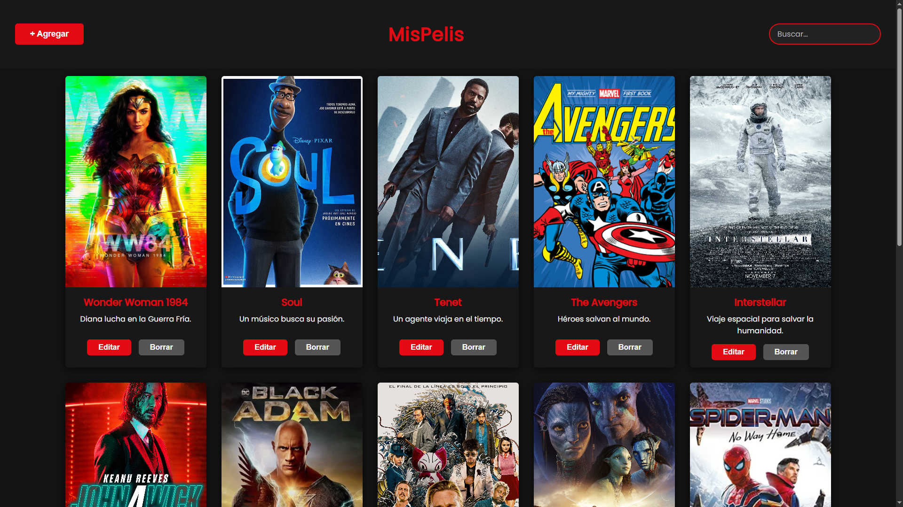

# App de Películas

Una aplicación web para gestionar un catálogo personal de películas, construida con React y Vite.

## Características

- Gestión completa de películas (crear, editar, eliminar)
- Búsqueda en tiempo real por título
- Persistencia de datos con localStorage
- Interfaz responsive y moderna

## Instalación

1. Clona el repositorio
```bash
git clone https://github.com/GinoRobla/curso-react.git
cd app-peliculas
```

2. Instala las dependencias
```bash
cd Frontend
npm install
```

3. Inicia el servidor de desarrollo
```bash
npm run dev
```

## Uso

### Comandos disponibles

```bash
npm run dev      # Servidor de desarrollo
npm run build    # Build de producción
npm run lint     # Ejecutar linter
npm run preview  # Vista previa del build
```

### Funcionalidades

- **Agregar película**: Clic en "Agregar Película" y completa el formulario
- **Buscar**: Usa la barra de búsqueda para filtrar por título
- **Editar**: Clic en el botón de editar en cualquier película
- **Eliminar**: Usa el botón de eliminar para borrar una película

## Estructura del Proyecto

```
Frontend/
├── src/
│   ├── components/
│   │   ├── Header/           # Barra de búsqueda y botón agregar
│   │   ├── Footer/           # Pie de página
│   │   └── Peliculas/
│   │       ├── Listado.jsx   # Lista de películas
│   │       ├── Crear.jsx     # Modal para crear
│   │       ├── Editar.jsx    # Modal para editar
│   │       └── PeliculaCard.jsx  # Tarjeta de película
│   ├── helpers/
│   │   └── GuardarEnStorage.js   # Utilidad localStorage
│   ├── App.jsx               # Componente principal
│   └── main.jsx              # Punto de entrada
├── package.json
└── vite.config.js
```

## Tecnologías

- **React 19** - Framework frontend
- **Vite** - Herramientas de desarrollo
- **ESLint** - Linter de código
- **localStorage** - Persistencia de datos

## Capturas de Pantalla



## Mejoras de Rendimiento

### Paginación
Para manejar grandes cantidades de películas, se puede implementar paginación:

```jsx
const usePagination = (data, itemsPerPage = 12) => {
  const [currentPage, setCurrentPage] = useState(1);
  
  const paginatedData = useMemo(() => {
    const startIndex = (currentPage - 1) * itemsPerPage;
    return data.slice(startIndex, startIndex + itemsPerPage);
  }, [data, currentPage, itemsPerPage]);
  
  return { currentPage, setCurrentPage, paginatedData };
};
```

### Búsqueda Optimizada
Implementar debounce para mejorar la búsqueda:

```jsx
const useDebounce = (value, delay) => {
  const [debouncedValue, setDebouncedValue] = useState(value);
  
  useEffect(() => {
    const handler = setTimeout(() => {
      setDebouncedValue(value);
    }, delay);
    
    return () => clearTimeout(handler);
  }, [value, delay]);
  
  return debouncedValue;
};
```

### Lazy Loading
Para imágenes grandes, usar lazy loading:

```jsx
const LazyImage = ({ src, alt }) => {
  const [isVisible, setIsVisible] = useState(false);
  const imgRef = useRef();
  
  useEffect(() => {
    const observer = new IntersectionObserver(
      ([entry]) => setIsVisible(entry.isIntersecting),
      { threshold: 0.1 }
    );
    
    if (imgRef.current) observer.observe(imgRef.current);
    return () => observer.disconnect();
  }, []);
  
  return (
    <div ref={imgRef}>
      {isVisible && }
    </div>
  );
};
```