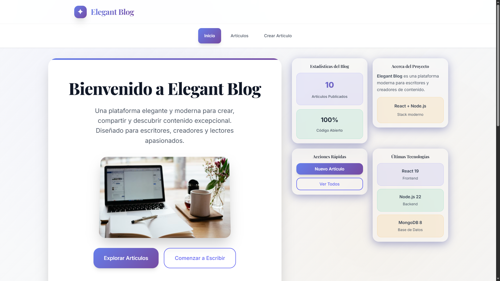
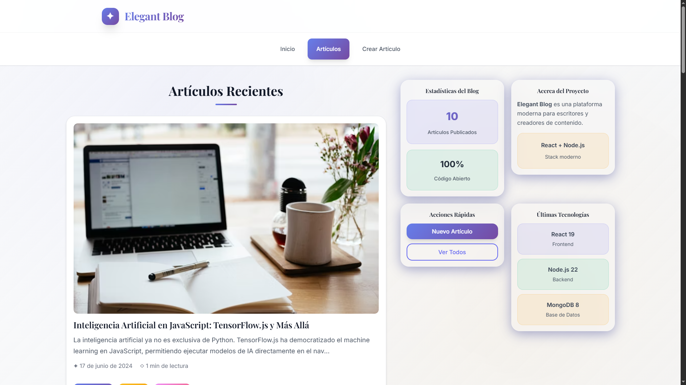
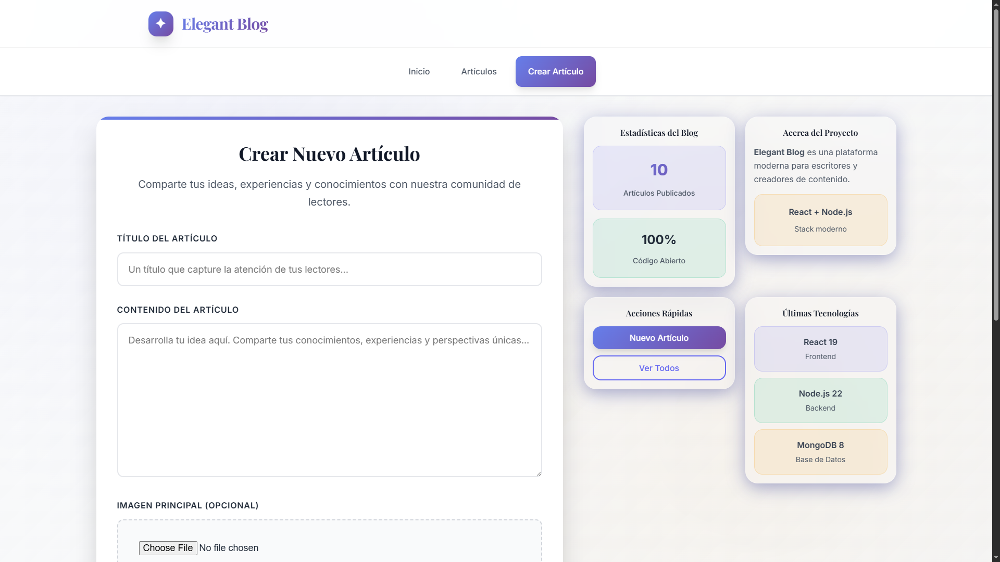

# Elegant Blog

Una aplicacion web moderna de blog desarrollada con **React** y **Node.js**, que permite crear, leer, actualizar y eliminar articulos con una interfaz elegante y responsive.

## Caracteristicas

- **Diseño moderno y elegante** con efectos glassmorphism
- **Completamente responsive** para moviles y tablets
- **Busqueda avanzada** de articulos por titulo o contenido
- **Paginacion inteligente** (6 articulos por pagina)
- **Gestion de imagenes** con subida y optimizacion
- **Modal personalizado** para confirmaciones
- **Estadisticas dinamicas** en tiempo real
- **Animaciones suaves** y transiciones fluidas
- **Actualizacion automatica** del contador de articulos
- **Editor intuitivo** para crear contenido

## Screenshots

### Pagina de Inicio

*Diseño elegante con informacion del proyecto y tecnologias utilizadas*

### Lista de Articulos

*Vista de todos los articulos con paginacion y acciones de gestion*

### Crear Articulo

*Formulario intuitivo para crear nuevos articulos con subida de imagenes*

## Tecnologias

### Frontend
- **React 19** - Biblioteca de interfaz de usuario
- **React Router DOM 7** - Enrutamiento del lado del cliente  
- **Vite** - Herramienta de construccion ultrarapida
- **CSS3** - Estilos modernos con variables CSS y Grid/Flexbox
- **Bootstrap Icons** - Iconografia moderna

### Backend
- **Node.js** - Entorno de ejecucion de JavaScript
- **Express.js 5** - Framework web minimalista
- **MongoDB 8** - Base de datos NoSQL
- **Mongoose** - ODM para MongoDB
- **Multer** - Middleware para subida de archivos
- **Validator** - Validacion de datos
- **CORS** - Configuracion de recursos cruzados

## Requisitos Previos

- **Node.js** >= 16.x
- **MongoDB** >= 5.x (local o Atlas)
- **npm** o **yarn**

## Instalacion y Configuracion

### 1. Clonar el Repositorio
```bash
git clone https://github.com/GinoRobla/curso-react.git
cd Blog
```

### 2. Configurar el Backend
```bash
cd backend
npm install
```

### 2. Configurar el Frontend  
```bash
cd ../frontend
npm install
```

### 3. Configurar MongoDB

**Opcion A: MongoDB Local**
- Asegurate de que MongoDB este ejecutandose en `mongodb://127.0.0.1:27017/blog`

**Opcion B: MongoDB Atlas**
- Modifica la cadena de conexion en `backend/basedatos/conexion.js`

### 4. Poblar la Base de Datos (Opcional)
```bash
cd backend
node seed.js
```
*Esto creara 10 articulos de ejemplo*

## Ejecutar la Aplicacion

### Iniciar el Backend
```bash
cd backend
npm start
```
*El servidor se ejecutara en http://localhost:3900*

### Iniciar el Frontend
```bash
cd frontend  
npm run dev
```
*La aplicacion se ejecutara en http://localhost:5174*

## Estructura del Proyecto

```
Blog/
├── backend/
│   ├── basedatos/
│   │   └── conexion.js          # Configuracion de MongoDB
│   ├── controladores/
│   │   └── Articulo.js          # Logica de negocio
│   ├── modelos/
│   │   └── Articulo.js          # Modelo de datos
│   ├── rutas/
│   │   └── Articulo.js          # Definicion de rutas API
│   ├── imagenes/
│   │   └── articulos/           # Almacen de imagenes
│   ├── index.js                 # Servidor principal
│   ├── seed.js                  # Datos de prueba
│   └── package.json
│
├── frontend/
│   ├── src/
│   │   ├── components/
│   │   │   ├── layout/          # Header, Nav, Sidebar, Footer
│   │   │   └── pages/           # Paginas de la aplicacion
│   │   ├── helpers/
│   │   │   ├── global.jsx       # Configuracion global
│   │   │   └── Peticion.jsx     # Cliente HTTP
│   │   ├── hooks/
│   │   │   └── useForm.js       # Hook personalizado
│   │   ├── routing/
│   │   │   └── Rutas.jsx        # Configuracion de rutas
│   │   ├── App.jsx              # Componente principal
│   │   ├── index.css            # Estilos globales
│   │   └── main.jsx             # Punto de entrada
│   ├── index.html
│   ├── vite.config.js
│   └── package.json
│
├── README.md                    # Este archivo
├── API_DOC.md                   # Documentacion de la API
└── package.json
```

## Funcionalidades Principales

### Gestion de Articulos
- **Crear** articulos con titulo, contenido e imagen
- **Leer** articulos individuales con diseño optimizado
- **Editar** articulos existentes (titulo, contenido, imagen)
- **Eliminar** articulos con confirmacion visual

### Busqueda y Navegacion  
- **Busqueda en tiempo real** por titulo y contenido
- **Paginacion automatica** cada 6 articulos
- **Navegacion fluida** entre paginas
- **Filtrado dinamico** de resultados

### Panel de Control
- **Contador automatico** de articulos publicados
- **Estadisticas en tiempo real**
- **Acciones rapidas** desde la barra lateral
- **Informacion del proyecto**

### Experiencia de Usuario
- **Diseño responsive** para todos los dispositivos
- **Animaciones suaves** y micro-interacciones  
- **Modal personalizado** para confirmaciones
- **Indicadores de carga** y estados

## Scripts Disponibles

### Backend
- `npm start` - Inicia el servidor con nodemon
- `node seed.js` - Puebla la base de datos con datos de ejemplo

### Frontend
- `npm run dev` - Servidor de desarrollo con hot reload
- `npm run build` - Construye la aplicacion para produccion
- `npm run preview` - Preview de la build de produccion
- `npm run lint` - Ejecuta el linter ESLint

## Endpoints API

Ver documentacion completa en [API_DOC.md](./API_DOC.md)

**Principales endpoints:**
- `GET /api/listar` - Lista todos los articulos
- `GET /api/articulo/:id` - Obtiene un articulo especifico
- `POST /api/crear` - Crea un nuevo articulo
- `PUT /api/articulo/:id` - Actualiza un articulo
- `DELETE /api/articulo/:id` - Elimina un articulo

## Personalizacion

### Colores y Tema
Los colores se pueden personalizar modificando las variables CSS en `frontend/src/index.css`:
```css
:root {
  --color-primary: #6366f1;
  --color-accent: #f59e0b;
  --gradient-primary: linear-gradient(135deg, #667eea 0%, #764ba2 100%);
}
```

### Configuracion de Paginacion
Para cambiar el numero de articulos por pagina, modifica en `frontend/src/components/pages/Listado.jsx`:
```javascript
const articulosPorPagina = 6; // Cambia este numero
```

## Responsive Design

La aplicacion esta optimizada para:
- **Moviles**: < 640px
- **Tablets**: 640px - 1024px  
- **Desktop**: > 1024px

## Validaciones

### Frontend
- Validacion de formularios en tiempo real
- Sanitizacion de entradas de usuario
- Control de tipos de archivo para imagenes

### Backend  
- Validacion de datos con Validator.js
- Sanitizacion de parametros
- Control de tipos MIME para imagenes
- Validacion de IDs de MongoDB

## Solucion de Problemas

### Error de Conexion a MongoDB
```bash
# Verificar que MongoDB este corriendo
sudo systemctl status mongod

# Iniciar MongoDB si esta detenido  
sudo systemctl start mongod
```

### Puerto en Uso
```bash
# Matar proceso en puerto 3900
npx kill-port 3900

# Matar proceso en puerto 5174
npx kill-port 5174
```

### Limpiar Cache
```bash
# Frontend
cd frontend && rm -rf node_modules package-lock.json && npm install

# Backend
cd backend && rm -rf node_modules package-lock.json && npm install
```

## Actualizaciones Futuras

- [ ] **Sistema de autenticacion** con JWT
- [ ] **Comentarios** en articulos
- [ ] **Categorias y etiquetas** 
- [ ] **Editor WYSIWYG** avanzado
- [ ] **Modo oscuro** completo
- [ ] **PWA** (Progressive Web App)
- [ ] **Tests automatizados** con Jest
- [ ] **Docker** para despliegue

## Autor

**Gino Robla**  
Email: ginoroblabelleggia@gmail.com  
GitHub: GinoRobla

## Contribuciones

Las contribuciones son bienvenidas. Para contribuir:

1. Fork el proyecto
2. Crea una rama para tu feature (`git checkout -b feature/AmazingFeature`)
3. Commit tus cambios (`git commit -m 'Add some AmazingFeature'`)
4. Push a la rama (`git push origin feature/AmazingFeature`)
5. Abre un Pull Request

---

Dale una estrella a este proyecto si te ha sido util!