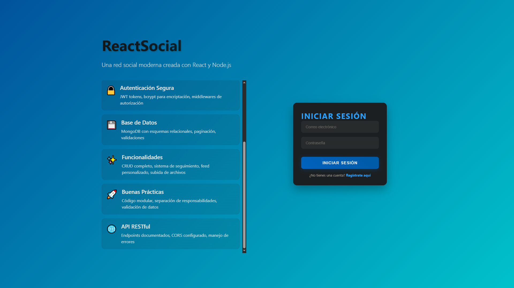
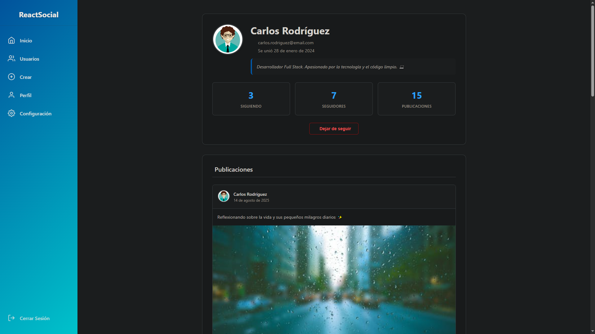

# Red Social - Full Stack Application

Una aplicación completa de red social desarrollada con Node.js, Express, MongoDB, React y JWT para autenticación.

## Screenshots

### Pantalla de Login y Registro
<div align="center">
  
  
</div>

### Feed Principal y Crear Publicación
<div align="center">
  
  
</div>

### Perfil de Usuario y Lista de Usuarios
<div align="center">
  
  
</div>

### Perfil de Otros Usuarios y Configuraciones
<div align="center">
  
  
</div>

## Características

- **Autenticación de usuarios** con JWT
- **Registro e inicio de sesión** de usuarios
- **Perfiles de usuario** con avatar personalizable
- **Sistema de seguimiento** (follow/unfollow)
- **Publicaciones** con texto e imágenes
- **Feed de noticias** personalizado
- **Lista de usuarios** y exploración de perfiles
- **Configuración de cuenta**

## Tecnologías Utilizadas

### Backend
- **Node.js** - Entorno de ejecución
- **Express.js** - Framework web
- **MongoDB** - Base de datos NoSQL
- **Mongoose** - ODM para MongoDB
- **JWT (jsonwebtoken)** - Autenticación
- **Bcrypt** - Encriptación de contraseñas
- **Multer** - Manejo de archivos
- **Cors** - Cross-Origin Resource Sharing
- **Validator** - Validación de datos

### Frontend
- **React 18** - Biblioteca de UI
- **React Router DOM** - Enrutamiento
- **Vite** - Build tool y dev server
- **JavaScript ES6+** - Lenguaje de programación
- **CSS3** - Estilos

## Estructura del Proyecto

```
Red-social/
├── backend/
│   ├── controllers/           # Controladores de la API
│   ├── database/             # Configuración de base de datos
│   ├── helpers/              # Funciones auxiliares
│   ├── middlewares/          # Middlewares (autenticación)
│   ├── models/              # Modelos de Mongoose
│   ├── routes/              # Rutas de la API
│   ├── seeds/               # Datos de prueba
│   ├── services/            # Servicios (JWT, seguimiento)
│   ├── uploads/             # Archivos subidos (avatares, publicaciones)
│   └── index.js             # Punto de entrada del servidor
├── frontend/
│   ├── src/
│   │   ├── components/      # Componentes React
│   │   ├── context/         # Context API (Auth)
│   │   ├── helpers/         # Funciones auxiliares
│   │   ├── hooks/           # Custom hooks
│   │   ├── assets/          # Estilos e imágenes
│   │   └── router/          # Configuración de rutas
│   └── index.html
└── README.md
```

## Instalación y Configuración

### Prerrequisitos
- Node.js (v14 o superior)
- MongoDB (local o Atlas)
- npm o yarn

### 1. Clonar el repositorio
```bash
git clone https://github.com/GinoRobla/curso-react.git
cd Red-social
```

### 2. Configurar Backend

```bash
cd backend
npm install
```

Crear archivo `.env` en la carpeta backend:
```env
PORT=3900
MONGODB_URI=mongodb://localhost:27017/red-social
JWT_SECRET=tu_clave_secreta_jwt
```

### 3. Configurar Frontend

```bash
cd frontend
npm install
```

### 4. Ejecutar la aplicación

#### Backend (Terminal 1)
```bash
cd backend
npm start
```
El servidor se ejecutará en `http://localhost:3900`

#### Frontend (Terminal 2)
```bash
cd frontend
npm run dev
```
La aplicación estará disponible en `http://localhost:5173`

## Base de Datos

### Modelos principales:

- **User**: Información de usuarios
- **Follow**: Relaciones de seguimiento
- **Publication**: Publicaciones de los usuarios

### Seeding (Datos de prueba)
```bash
cd backend
npm run seed
```

## Autenticación

La aplicación utiliza JWT (JSON Web Tokens) para la autenticación. Los tokens se envían en el header `Authorization: Bearer <token>`.

## Funcionalidades Principales

### Gestión de Usuarios
- Registro de nuevos usuarios
- Inicio de sesión
- Actualización de perfil
- Subida de avatar
- Visualización de contadores (publicaciones, seguidores, seguidos)

### Sistema de Seguimiento
- Seguir/dejar de seguir usuarios
- Lista de usuarios seguidos
- Lista de seguidores

### Publicaciones
- Crear publicaciones con texto
- Subir imágenes en publicaciones
- Feed personalizado basado en usuarios seguidos
- Eliminar publicaciones propias

## Interfaz de Usuario

La aplicación cuenta con:
- **Layout público**: Para login y registro
- **Layout privado**: Para la aplicación principal
- **Diseño responsivo**: Adaptable a diferentes dispositivos
- **Navegación intuitiva**: Sidebar con las principales funciones

## Scripts Disponibles

### Backend
- `npm start` - Inicia el servidor con nodemon
- `npm run seed` - Ejecuta el seeding de la base de datos

### Frontend
- `npm run dev` - Inicia el servidor de desarrollo
- `npm run build` - Construye la aplicación para producción
- `npm run preview` - Previsualiza la build de producción
- `npm run lint` - Ejecuta el linter

## API Endpoints

La API está documentada en detalle en [API_DOC.md](./API_DOC.md)

Principales rutas:
- `/api/user/*` - Gestión de usuarios
- `/api/follow/*` - Sistema de seguimiento
- `/api/publication/*` - Gestión de publicaciones

## Contribuciones

1. Fork el proyecto
2. Crea una rama para tu feature (`git checkout -b feature/AmazingFeature`)
3. Commit tus cambios (`git commit -m 'Add some AmazingFeature'`)
4. Push a la rama (`git push origin feature/AmazingFeature`)
5. Abre un Pull Request

## Autor

**Gino** - Desarrollador Full Stack

---

Si te gusta este proyecto, no olvides darle una estrella!