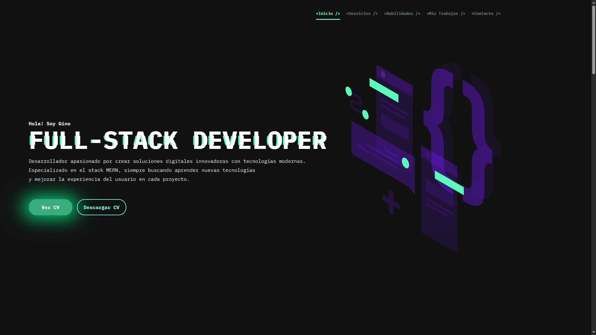
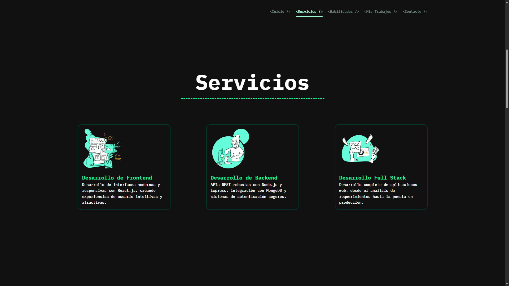
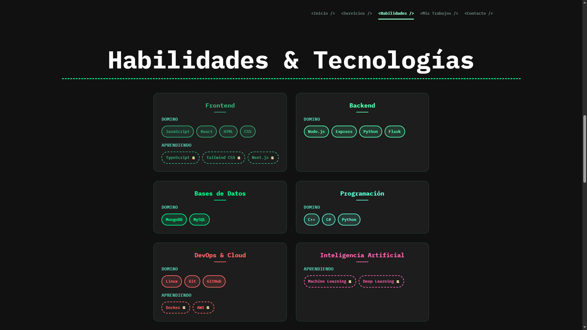
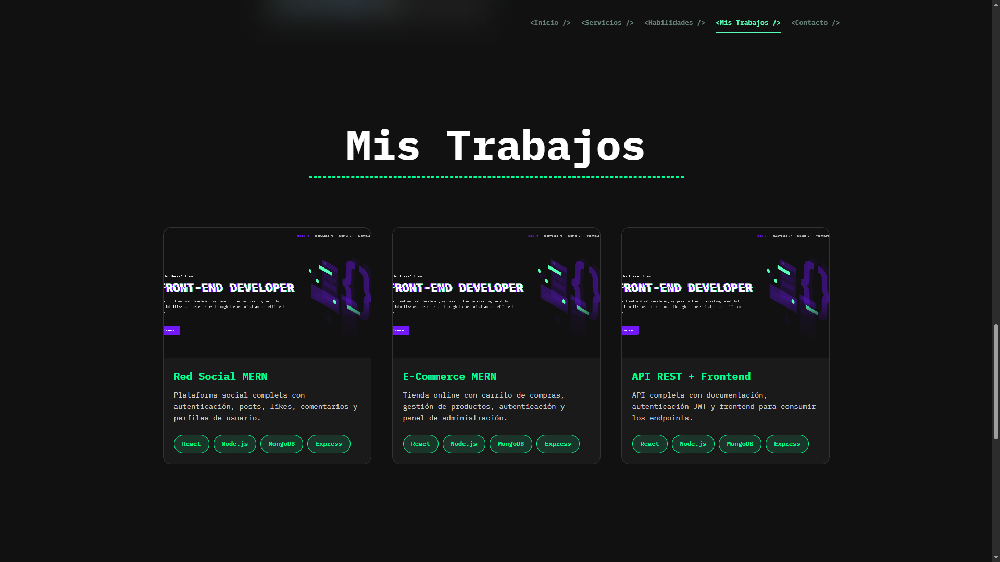
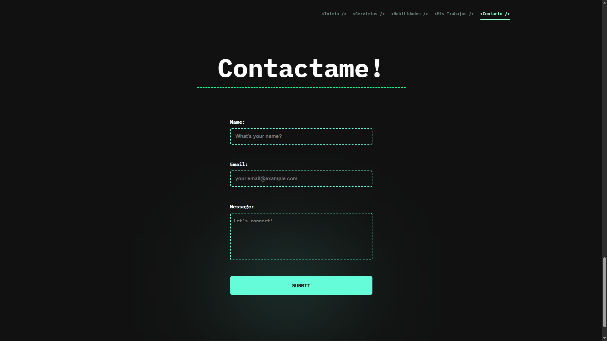

# Mi Portafolio - Proyecto del Curso de React

> **Nota importante:** Este no es mi portafolio principal. Es un proyecto desarrollado como parte de mi aprendizaje en el curso de React.

## 📋 Descripción

Este es un portafolio personal desarrollado con React y Vite, creado como proyecto de práctica durante el curso de React. Incluye secciones de servicios, habilidades, trabajos y un formulario de contacto completamente funcional.

## ✨ Características

- **Diseño responsive** - Se adapta a diferentes tamaños de pantalla
- **Formulario de contacto funcional** - Utiliza EmailJS para envío directo al email/navegador
- **Navegación suave** - Experiencia de usuario fluida
- **Componentes modulares** - Estructura de código organizada y mantenible
- **Validación de formularios** - Validación del lado cliente
- **Estados de carga** - Feedback visual durante el envío de formularios

## 🚀 Instalación

### Prerrequisitos

- Node.js (versión 14 o superior)
- npm o yarn

### Pasos de instalación

1. Clona el repositorio:
```bash
git clone https://github.com/tu-usuario/portafolio-gino.git
```

2. Navega al directorio del proyecto:
```bash
cd portafolio-gino
```

3. Instala las dependencias:
```bash
npm install
```

4. Inicia el servidor de desarrollo:
```bash
npm run dev
```

5. Abre tu navegador y visita `http://localhost:5173`

## 🛠️ Scripts disponibles

- `npm run dev` - Inicia el servidor de desarrollo
- `npm run build` - Construye el proyecto para producción
- `npm run preview` - Vista previa del build de producción
- `npm run lint` - Ejecuta el linter

## 📧 Configuración del Formulario de Contacto

El formulario de contacto está completamente configurado y funcional usando EmailJS. Los mensajes se envían directamente a tu email/navegador.

### Características del formulario:
- Validación de campos requeridos
- Validación de formato de email
- Estados de carga visual
- Mensajes de confirmación/error
- Limpieza automática del formulario tras envío exitoso

## 🖼️ Screenshots

### Página de Inicio


### Servicios


### Habilidades


### Mis Trabajos


### Formulario de Contacto


## 🏗️ Estructura del Proyecto

```
portafolio-gino/
├── public/
│   └── vite.svg
├── src/
│   ├── assets/
│   │   ├── icons/
│   │   ├── illustrations/
│   │   ├── services/
│   │   └── works/
│   ├── components/
│   │   ├── Contact.jsx      # Formulario de contacto con EmailJS
│   │   ├── Footer.jsx       # Pie de página
│   │   ├── Header.jsx       # Cabecera y navegación
│   │   ├── Services.jsx     # Sección de servicios
│   │   ├── Skills.jsx       # Habilidades técnicas
│   │   └── Works.jsx        # Portafolio de trabajos
│   ├── styles/
│   │   ├── contact.css      # Estilos del formulario
│   │   ├── footer.css       # Estilos del footer
│   │   ├── global.css       # Estilos globales
│   │   ├── header.css       # Estilos de la cabecera
│   │   ├── services.css     # Estilos de servicios
│   │   ├── skills.css       # Estilos de habilidades
│   │   └── works.css        # Estilos de trabajos
│   ├── App.jsx             # Componente principal
│   ├── main.jsx            # Punto de entrada
│   └── index.css           # Estilos base
├── screenshots/            # Capturas de pantalla del proyecto
├── package.json
└── README.md
```

## 🔧 Tecnologías Utilizadas

- **React 19** - Biblioteca de JavaScript para interfaces de usuario
- **Vite** - Herramienta de build rápida
- **EmailJS** - Servicio para envío de emails desde el frontend
- **CSS3** - Estilos personalizados
- **ESLint** - Linter para mantener calidad del código

## 📱 Responsive Design

El proyecto está completamente optimizado para diferentes dispositivos:
- **Desktop** - Experiencia completa con todas las características
- **Tablet** - Layout adaptado para pantallas medianas
- **Mobile** - Diseño optimizado para dispositivos móviles

## 🎯 Propósito Educativo

Este proyecto fue desarrollado como parte del aprendizaje en:
- Componentes funcionales de React
- Hooks (useState, useEffect)
- Manejo de formularios y validación
- Integración con servicios externos (EmailJS)
- Organización de componentes y estilos
- Build y deployment con Vite